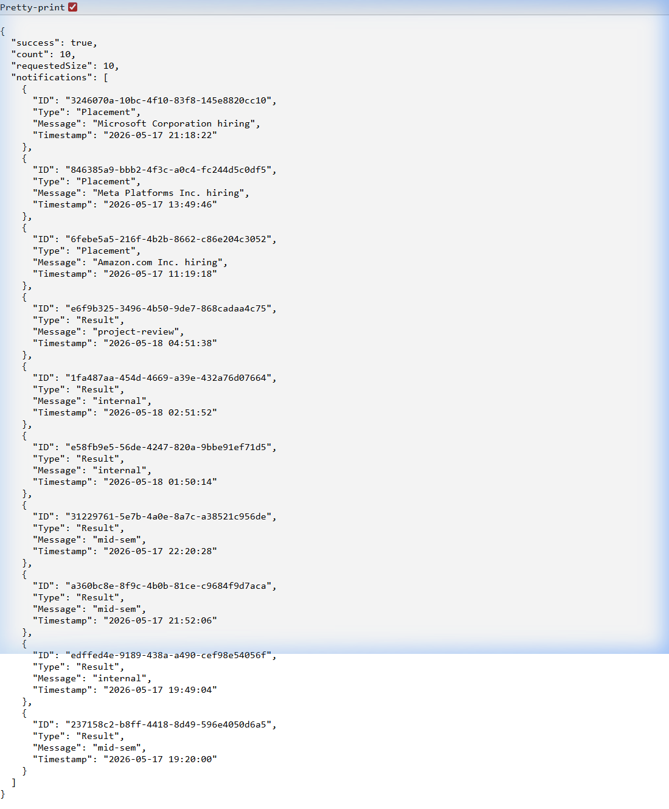
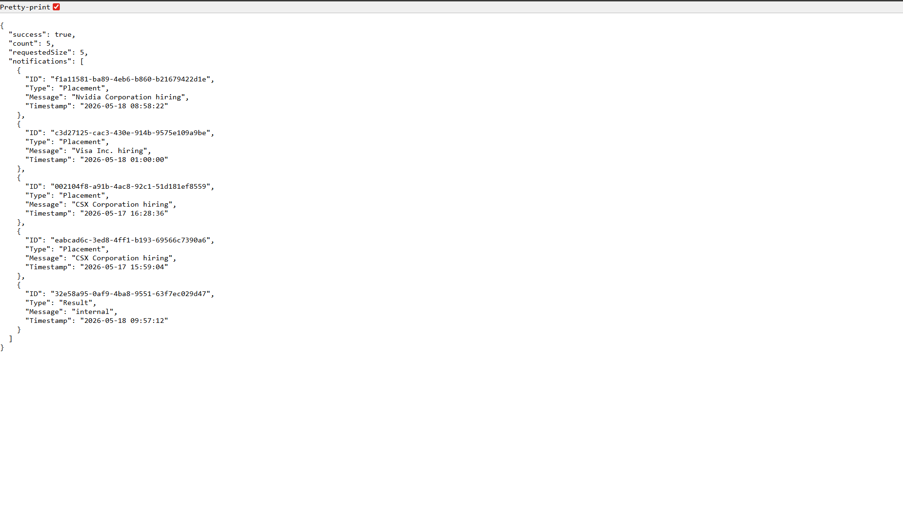

# 🔔 Campus Notification Priority Inbox System

> **Stage 1 – TE AI & DSA Evaluation Project**  
> A full-stack campus notification system featuring an efficient **Priority Inbox** powered by a custom **Fixed-Capacity Min-Heap** algorithm, complete with an Express backend, async logging middleware, and a React/MUI dark-mode frontend.

---

## 📸 Screenshots

### Priority API Response — Top 10 Notifications (`n=10`)


### Priority API Response — Top 5 Notifications (`n=5`)


### Live Demo Recording


---

## 🏗️ Project Architecture

```
TEAI&DSA13/
│
├── notification_app_be/        # Node.js + Express backend
│   ├── server.js               # API routes + MinHeap logic
│   └── package.json
│
├── notification_app_fe/        # React + TypeScript + Vite frontend
│   ├── src/
│   │   └── App.tsx             # Full UI with MUI dark theme
│   └── package.json
│
├── logging_middleware/         # Reusable async HTTP logging module
│   ├── logger.js               # logToServer() — sends structured logs
│   └── middleware.js           # Express middleware (request interceptor)
│
├── Notification_System_Design.md  # System design document
├── screenshot_priority_n10.png    # API output – Top 10
├── screenshot_priority_n5.png     # API output – Top 5
├── demo_recording.webp            # Live demo recording
├── .env                           # Environment variables (gitignored)
├── .gitignore
└── README.md
```

---

## ⚙️ Core Algorithm: Fixed-Capacity Min-Heap

The heart of the Priority Inbox is a **custom Min-Heap** with a fixed capacity of `N`.

### Why Not Just Sort?
A naive sort on every new notification costs **O(M log M)** per update (where M = total notifications). With a Fixed-Capacity Min-Heap of size N:

| Operation | Cost |
|---|---|
| New notification beats heap root | O(log N) — replace root & re-heapify |
| New notification is lower priority | O(1) — discarded immediately |
| Space complexity | O(N) — heap never exceeds N items |

### Priority Rules

| Priority | Category | Weight |
|---|---|---|
| 🥇 Highest | Placement | 3 |
| 🥈 | Result | 2 |
| 🥉 | Event | 1 |
| — Lowest | Others | 0 |

**Tie-breaking:** Within the same weight tier → newer timestamp wins → on timestamp tie → earlier insertion order wins.

---

## 🚀 Getting Started

### Prerequisites

- **Node.js** v18+
- **npm** v9+

### 1. Clone the Repository

```bash
git clone https://github.com/rohitmane45/TEAI-DSA13.git
cd TEAI-DSA13
```

### 2. Configure Environment Variables

Create a `.env` file in the **project root** (see `.gitignore` — this file is not committed):

```env
# Test Server Credentials
EMAIL=your_email@example.com
NAME=Your Name
ROLL_NO=your_roll_number
ACCESS_CODE=your_access_code
CLIENT_ID=your_client_id
CLIENT_SECRET=your_client_secret

# Test Server Endpoints
TEST_SERVER_AUTH_URL=http://<test-server>/evaluation-service/auth
TEST_SERVER_NOTIFICATIONS_URL=http://<test-server>/evaluation-service/notifications
TEST_SERVER_LOGS_URL=http://<test-server>/evaluation-service/logs

# Backend Port
PORT=5000
```

### 3. Install & Run the Backend

```bash
cd notification_app_be
npm install
npm run dev
```

> Server starts on **http://localhost:5000**

### 4. Install & Run the Frontend

```bash
cd notification_app_fe
npm install
npm run dev
```

> Frontend starts on **http://localhost:5173**

---

## 🛣️ API Endpoints

### `GET /notifications/priority`

Returns the **top N highest-priority** campus notifications using the Min-Heap algorithm.

| Query Param | Type | Default | Description |
|---|---|---|---|
| `n` | `integer` | `10` | Number of top-priority notifications to return |

**Example Request:**
```
GET http://localhost:5000/notifications/priority?n=10
```

**Example Response:**
```json
{
  "success": true,
  "count": 10,
  "requestedSize": 10,
  "notifications": [
    {
      "ID": "f1a11581-ba89-4eb6-b860-b21679422d1e",
      "Type": "Placement",
      "Message": "Nvidia Corporation hiring",
      "Timestamp": "2026-05-18 08:58:22"
    }
    // ...
  ]
}
```

---

### `GET /notifications`

Returns a **paginated and filtered** list of all campus notifications.

| Query Param | Type | Description |
|---|---|---|
| `limit` | `integer` | Number of items per page |
| `page` | `integer` | Page number |
| `notification_type` | `string` | Filter by type: `Placement`, `Result`, `Event` |

**Example Request:**
```
GET http://localhost:5000/notifications?limit=10&page=1&notification_type=Placement
```

---

## 📡 Logging Middleware

Every HTTP request is automatically intercepted by the **Logging Middleware** (`logging_middleware/middleware.js`), which:

1. Records request start time.
2. Listens for the `finish` event on the response.
3. Computes **total request duration** in milliseconds.
4. Maps the HTTP status code to a log level:
   - `500+` → `error`
   - `400–499` → `warn`
   - `< 400` → `info`
5. Dispatches a **structured log** asynchronously to the test server's Log API (via `logToServer`) — **without blocking the response**.

### Log Payload Schema

```json
{
  "stack": "backend",
  "level": "info | warn | error | fatal",
  "package": "controller | cache | db | cron_job | domain",
  "message": "HTTP GET /notifications/priority -> Status: 200 (45ms)"
}
```

---

## 🖥️ Frontend Overview

The React frontend (`notification_app_fe`) is built with:

- **React 18 + TypeScript** via **Vite**
- **Material UI (MUI v6)** for component library
- **Custom Dark Theme** — Indigo (`#6366f1`) + Cyan (`#06b6d4`) accent palette
- **Glassmorphism Cards** with hover lift animations
- **Google Font: Outfit** for modern typography

### UI Features

| Feature | Description |
|---|---|
| **All Notifications Tab** | Paginated list with category & items-per-page filters |
| **Priority Inbox Tab** | Real-time top-N display; configurable N input |
| **Read/Unread Tracking** | Persisted in `localStorage`; visual strikethrough on read |
| **Mark All as Read** | One-click bulk read action |
| **Refresh Button** | Manual data re-fetch |
| **Category Chips** | Color-coded: 🟡 Placement · 🟢 Result · 🔴 Event · ⚪ General |

---

## 📐 System Design

For a detailed explanation of the Min-Heap design, priority logic, time & space complexity analysis, and real-time notification handling strategies, see:

📄 **[Notification_System_Design.md](./Notification_System_Design.md)**

---

## 🧰 Tech Stack

| Layer | Technology |
|---|---|
| Backend Runtime | Node.js |
| Backend Framework | Express.js |
| HTTP Client | Axios |
| Frontend Framework | React 18 + TypeScript |
| Frontend Build Tool | Vite |
| UI Component Library | Material UI (MUI) v6 |
| Logging | Custom async middleware → Test Server Log API |
| Environment Config | dotenv |

---

## 📁 Key Files Reference

| File | Purpose |
|---|---|
| `notification_app_be/server.js` | Core API + MinHeap class implementation |
| `logging_middleware/logger.js` | `logToServer()` — authenticated log dispatch |
| `logging_middleware/middleware.js` | Express request lifecycle interceptor |
| `notification_app_fe/src/App.tsx` | Full React UI with theme, state, and data fetching |
| `Notification_System_Design.md` | In-depth algorithm and architecture design document |

---

## 📝 License

This project is developed as part of the **TE AI & DSA (Stage 1)** evaluation and is intended for academic use.
